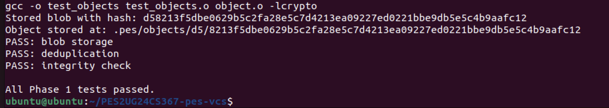
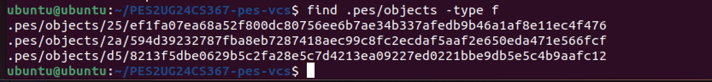
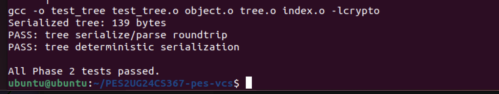
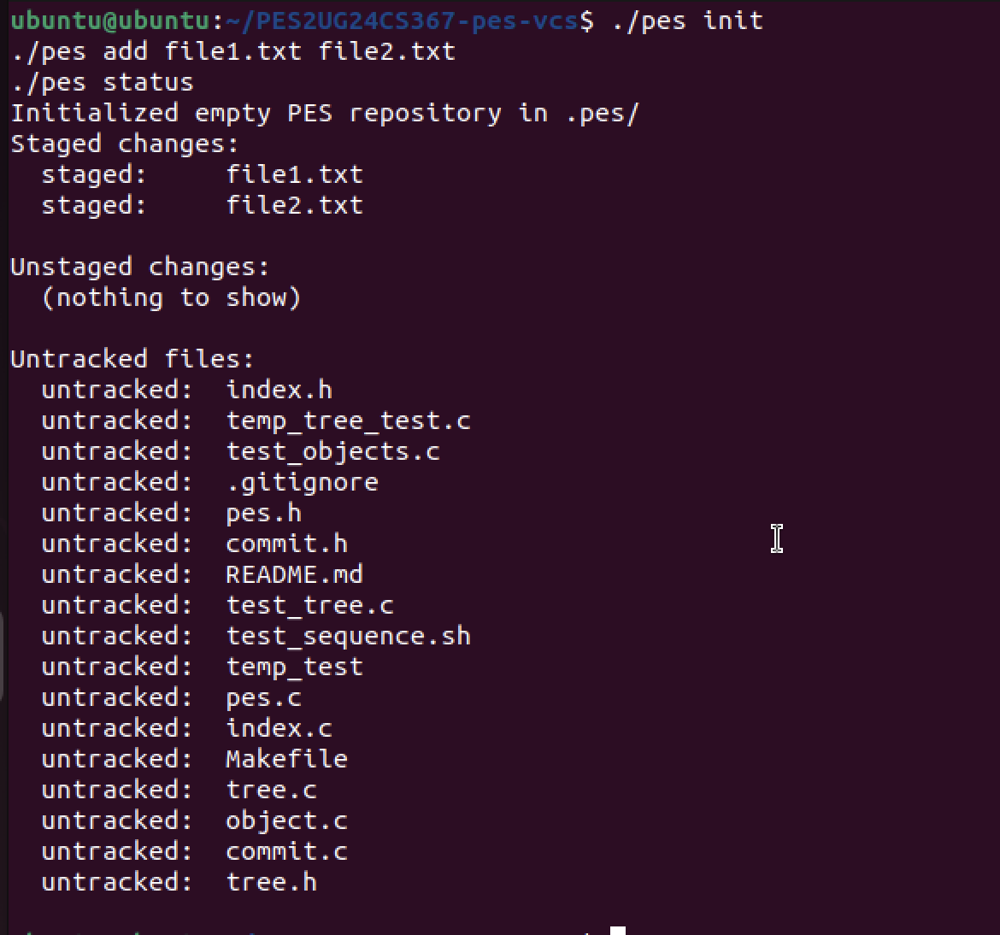
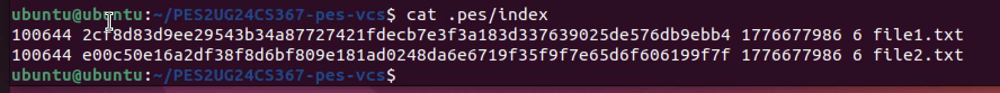
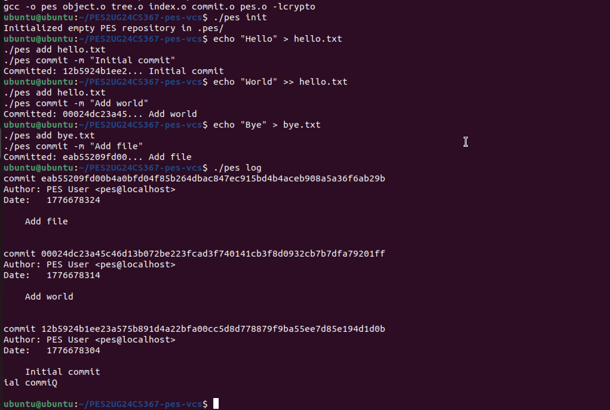
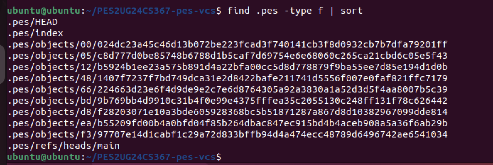
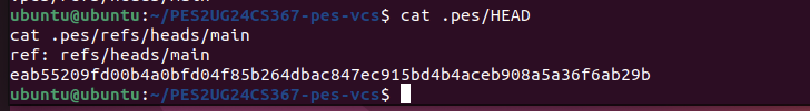
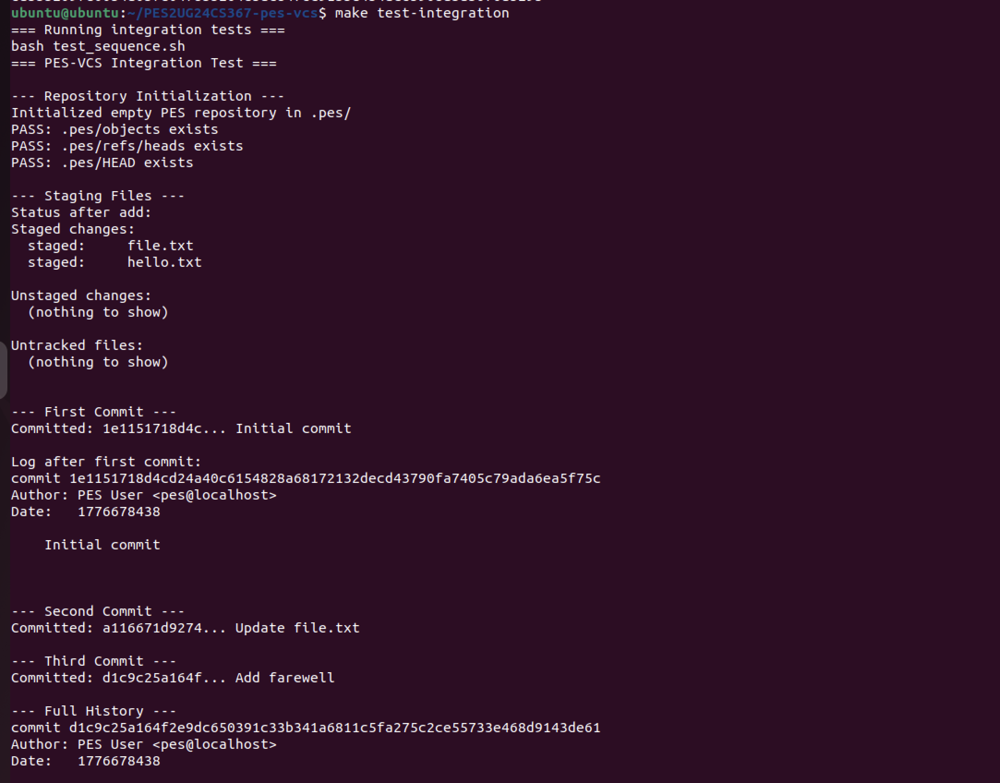
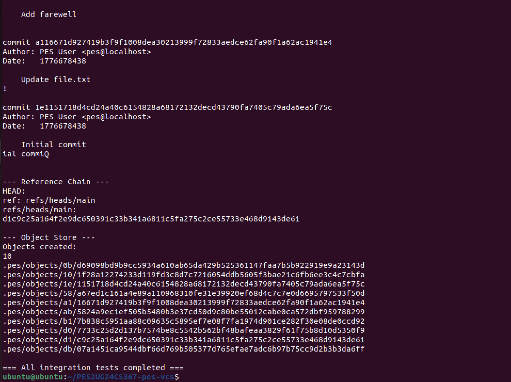

# PES-VCS — Version Control System

## Student Details
Name: Prarthana Herur  
SRN: PES2UG24CS367  

---

## Phase 1: Object Storage

### Description
Implemented SHA-256 based content-addressable storage.
Objects are stored in `.pes/objects` using directory sharding.

### Output
1A

1B

---

## Phase 2: Tree Objects

### Description
Implemented tree structure for directories with serialization.

### Output
2A

2B

---

## Phase 3: Index (Staging Area)

### Description
Implemented staging area using a text-based index file.

### Output
3A

3B

---

## Phase 4: Commits and History

### Description
Implemented commit creation and log functionality.

### Output
4A

4B

4C

---
---

## Full Integration Test

### Description
This test verifies the complete workflow of the PES-VCS system including:
- Repository initialization
- Adding files
- Creating commits
- Viewing commit history

### Output

  

---
## Analysis Questions

### Q5.1 — Branching and Checkout
A branch is a file storing a commit hash.  
Checkout involves updating HEAD and replacing the working directory using the target tree.  
This is complex because it must avoid overwriting uncommitted changes.

---

### Q5.2 — Dirty Working Directory Detection
The system compares file metadata (mtime and size) in the index with the working directory.  
If differences exist, checkout is prevented to avoid data loss.

---

### Q5.3 — Detached HEAD
In detached HEAD, HEAD points directly to a commit instead of a branch.  
New commits are not linked to any branch but can be recovered using commit hashes.

---

### Q6.1 — Garbage Collection
Start from all branch heads, traverse commits, mark reachable objects, and delete unreachable ones.  
A hash set is used to track visited objects efficiently.

---

### Q6.2 — GC Race Condition
If garbage collection runs during a commit, it may delete objects being created.  
Git avoids this using locking and atomic updates.

---

## Conclusion

This project demonstrates how a version control system works internally by implementing object storage, tree structures, staging, and commit history.  
It provides a strong understanding of filesystem design and data integrity used in Git.
